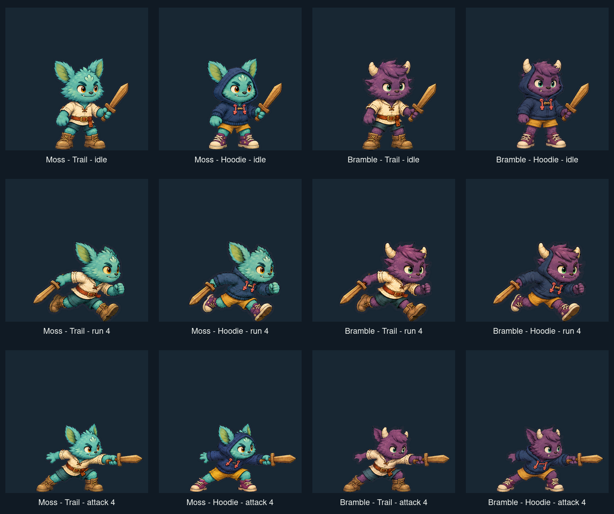

# Softwood Paper Doll Lab

Softwood is a playable vertical slice for a deterministic hybrid paper-doll character system. A fixed 60 Hz simulation resolves identity, outfit, and held-item choices through explicit semantic layers without resetting movement or animation time. Normal play presents authored painterly pose bundles; layer-debug mode reveals the same composition as anchor-aligned semantic pieces.



The board above is cropped directly from the committed runtime atlases. It is not separate concept art.

[Inspect the complete four-loadout, six-frame run board.](docs/screenshots/run-cycle-board.png)

The MVP includes:

- identities `moss` (Moss) and `bramble` (Bramble);
- outfits `trail` (Trail Set) and `hoodie` (Cloud Hoodie; labelled “Scout hoodie” in the inspector);
- the optional `wooden-sword` (Wooden Practice Sword);
- `idle`, `run`, `jump`, `fall`, `land`, and `attack` animations, comprising 21 deterministic frame IDs;
- twenty reproducibly built raster sheets: armed/unarmed general and six-drawing run sheets for every identity/outfit pair, plus a dedicated six-drawing equipped attack sequence for each pair;
- eight selectable loadouts. The compatibility gallery displays the four identity/outfit combinations with the sword equipped;
- layer, anchor, timeline, frame-step, and frame-time diagnostics.

Appearance swaps are transactions: a candidate is resolved across every authored frame before it is committed. Simulation position, velocity, facing, tick, and animation progress remain untouched.

## Run locally

```bash
npm install
npm run dev
```

Vite serves the lab at <http://localhost:4173>. A production build can be checked with:

```bash
npm run build
npm run preview
```

### Commands

| Command | Purpose |
| --- | --- |
| `npm run dev` | Start the Vite development server on port 4173. |
| `npm run build` | Type-check with `tsc -b`, then create the Vite production bundle. |
| `npm run preview` | Serve the production build on port 4173. |
| `npm run assets:build` | Rebuild the 12 transparent runtime atlases from the controlled source sheets (requires ImageMagick). |
| `npm run assets:check` | Rebuild to a temporary directory and verify that every committed atlas is byte-identical. |
| `npm test` | Run the Vitest unit suites once. |
| `npm run test:watch` | Run Vitest in watch mode. |
| `npm run test:e2e` | Run the Playwright interaction and frame-time suites. |
| `npm run test:visual` | Compare the five Playwright visual scenarios with their baselines. |
| `npm run test:visual:update` | Deliberately replace the visual baselines. Review the resulting images. |
| `npm run verify:browser` | Smoke-test an already running server and write a browser capture. |
| `npm run check` | Run unit tests, build, end-to-end tests, and visual tests in sequence. |

Install Playwright’s browser once if it is not already available:

```bash
npx playwright install chromium
```

Playwright and the browser smoke script use Playwright-managed Chromium by default. To use a particular local binary instead, set `CHROMIUM_EXECUTABLE_PATH` for the command:

```bash
CHROMIUM_EXECUTABLE_PATH=/path/to/chromium npm run test:e2e
```

`npm run verify:browser` defaults to `http://127.0.0.1:4173` and `.gauntlet/captures/current/browser-smoke.png`; an alternate URL and output path may be passed after `--`.

## Controls

| Action | Keyboard | UI |
| --- | --- | --- |
| Move | `A` / `D` or left / right arrows | Left / right touch buttons |
| Jump | `W`, up arrow, or `Space` | Jump button |
| Attack | `J` or `K` | Attack button |
| Cycle identity | `Q` | Moss / Bramble selector |
| Cycle outfit | `E` | Trail set / Scout hoodie selector |
| Toggle sword | `R` | Practice sword toggle |
| Toggle gallery | `G` | Preview all combinations button |

Attacks start only while grounded. The inspector can also force any animation, pause the clock, and step to the previous or next authored frame. Frame stepping pauses playback automatically.

### Debug modes

- **Layer stack** tints resolved pieces by semantic layer and lists their final draw order.
- **Anchors** shows selected body, limb, item, root, and ground sockets.
- **Compatibility gallery** renders the four sword-equipped identity/outfit combinations at the same animation frame.
- **Telemetry** shows animation progress, position, velocity, and missing palette tokens in the UI; `window.__PAPER_DOLL__` additionally exposes snapshots and frame-time percentiles to tests.

Reproducible states can be opened with query parameters:

```text
/?paused=1&animation=attack&tick=13&debug=layers,anchors
```

Supported parameters are `animation=<id>`, positive integer `tick=<n>`, `gallery=1`, `paused=1`, `testMode=1` (a pause alias used by tests), and comma-separated `debug=layers,anchors`.

## Design and authoring

- [Architecture](docs/ARCHITECTURE.md) — state ownership, resolution order, coordinate spaces, persistence, and determinism.
- [Asset pipeline](docs/ASSET_PIPELINE.md) — how the current TypeScript-authored vectors become rendered pieces, and how to add content.
- [Schema](docs/SCHEMA.md) — canonical IDs, anchors, layers, metadata, animation coverage, and validation rules.

## Verification matrix

| Layer | What it guards |
| --- | --- |
| Asset build | Deterministically rebuilds all 12 packed atlases and rejects stale output. |
| Unit | Integer animation timing, semantic composition, 168 authored-presentation selections, stable signatures, atomic swaps, raster schema validation, and pose metadata. |
| End to end | Error-free boot, swap preservation during run/attack, debug controls, gallery/frame stepping, and a headless frame-time regression gate. |
| Visual | Gallery poses for `idle`, `run`, and `attack`; attack layer/anchor alignment; and left-facing grounded-root behavior. |
| Browser smoke | Canvas/content/error checks plus a serialized harness snapshot and screenshot. |

The default validator exhaustively resolves 168 combinations: 2 identities × 2 outfits × sword on/off × 21 frames.

## Known limits and next steps

This is deliberately a vertical slice. The final paintings are full-pose presentation bundles selected by the semantic composition, not independently painted raster files for all 18 visible paper-doll layers. The semantic layer stack remains authoritative for rules, traces, hide/replace diagnostics, anchors, and vector fallback, but adding arbitrary wardrobe content still requires authoring matching presentation sheets. Frames are discrete, only one outfit and one optional weapon slot exist, and the semantic signature is not a pixel digest.

The most useful next step is to split each polished key pose into painted semantic underlaps (head/face, front and rear limbs, torso clothing, hands, feet, hair/fur, and weapon) and pack them into a versioned atlas manifest. That preserves the current visual bar while allowing new outfits to combine without a pre-authored full-pose bundle. Registry-driven UI, schema migration, broader slots, and target-device profiling follow after that boundary is stable.
